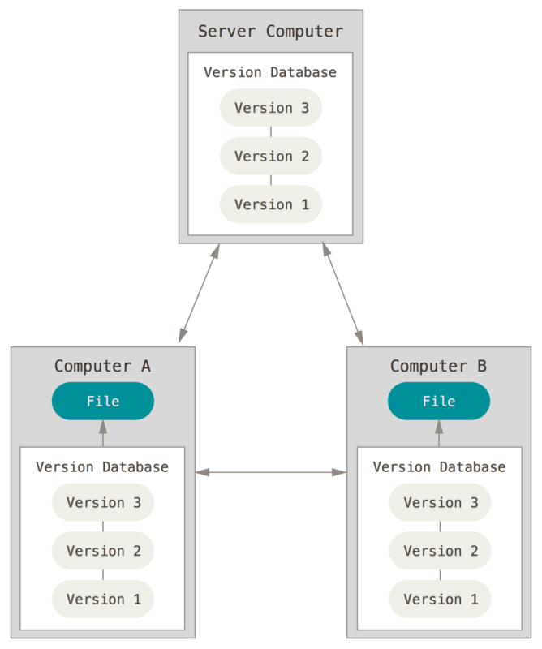

# [1회차] git 기초 / 자료구조

# Git

---

## 버전관리시스템의 필요성



***Git은 데이터를 Change Set이나 변경사항(Diff)으로 기록하지 않고 일련의 스냅샷으로 기록*** !!

- 커밋이란
    - Git은 현 Staging Area에 있는 데이터의 스냅샷에 대한 포인터, 저자나 커밋 메시지 같은 메타데이터, 이전 커밋에 대한 포인터 등을 포함하는 커밋 개체(커밋 Object)를 저장
    - 최초 커밋 제외하면 모든 커밋에 대한 포인터가 존재 → 이전 커밋 포인터가 있어서 현재 커밋이 무엇을 기준으로 바뀌었는지를 알 수 있음

## 기본 command

```bash
$ git add .
$ git commit -m "[커밋분류] 커밋 상세"
$ git push origin 브랜치네임

$ git status
$ git log

$ git checkout 브랜치네임
$ git checkout -b 브랜치네임

$ git branch
```

```bash
$ git commit --amend // 커밋 재작성 

ex. 
$ git commit -m 'initial commit'
$ git add forgotten_file
$ git commit --amend

$ git reset HEAD CONTRIBUTING.md // add 취소 

$ git checkout -- CONTRIBUTING.md // 파일 수정한 부분 취소 
```

- 꼭 읽어봤음 좋겠는 내용들

[https://git-scm.com/book/ko/v2](https://git-scm.com/book/ko/v2) → git의 기초, git 브랜치 

## Git Flow vs. Github Flow

### Git Flow

- flow: `feature` → `develop` → `release` → `hotfix` → `master`
1. **`Master`:** 릴리즈 시 사용하는 최종 단계 메인 브랜치
    - Tag를 통해 버전 관리를 한다.
2. **`Develop`:** 다음 릴리즈 버전 개발을 진행하는 브랜치
    - 추가 기능 구현이 필요해지면, 해당 브랜치에서 다시 브랜치(Feature)를 내어 개발을 진행하고, 완료된 기능은 다시 Develop 브랜치로 Merge한다.
3. **Feature:** Develop 브랜치에서 기능 구현을 할 때 만드는 브랜치
    - 한 기능 단위마다 Feature 브랜치를 생성하는게 원칙이다.

4. **Release:** Develop에서 파생된 브랜치

- Master 브랜치로 현재 코드가 Merge 될 수 있는지 테스트하고, 이 과정에서 발생한 버그를 고치는 공간이다. 확인 결과 이상이 없다면, 해당 브랜치는 Master와 Merge한다.
1. **Hotfix:** Mater브랜치의 버그를 수정하는 브랜치
    - 검수를 해도 릴리즈된 Master 브랜치에서 버그가 발견되는 경우가 존재한다. 이때 Hotfix 브랜치를 내어 버그 수정을 진행한다. 디버그가 완료되면 Master, Develop 브랜치에 Merge해주고 브랜치를 닫는다.
- `git-flow`에서 가장 중심이 되는 브랜치는 `master`와 `develop`이다. (무조건 필요)
- 진행 과정 중에 Merge된 `feature`, `release`, `hotfix` 브랜치는 닫아서 삭제

> 적합: 계획적인 릴리즈를 가지고 스케줄이 짜여진 대규모 프로젝트
> 

\+\ 불필요한 절차들이 많아 생산성을 떨어뜨린다는 의견 


### Github Flow

- git flow의 `hotfix`나 `feature` 브랜치를 구분하지 않고, pull request를 권장
- `Master` : 항상 최신으로 유지하며, Stable한 상태로 product에 배포되는 브랜치
- 새로운 브랜치는 항상 `Master` 브랜치에서 만들며, 새로운 기능 추가나 버그 해결을 위한 브랜치는 해당 역할에 대한 이름을 명확하게 지어주고, 커밋 메시지 또한 알기 쉽도록 작성
- Merge 전에는 `pull request`를 통해 공유하여 코드 리뷰를 진행한다. 이를 통해 피드백을 받고, Merge 준비가 완료되면 Master 브랜치로 요청
- Merge가 완료되면, push를 진행하고 자동으로 배포가 완료된다. (GitHub-flow의 핵심적인 부분)


](./1회차/Untitled%203.png)

[https://techblog.woowahan.com/2553/](https://techblog.woowahan.com/2553/)

\+\ 우리 스터디 깃 리파지토리도 Github Flow 

# 자료구조

---

> 메모리의 효율적인 사용을 위해
> 


## 복잡도

### 시간 복잡도

알고리즘의 절대적인 실행 시간이 아닌 연산이 몇 번 이루어지는 지를 숫자로 나타낸 것

(여기서 연산의 종류는 산술, 대입, 비교, 이동 등) ******

→ 연산의 실행 횟수는 입력한 데이터의 개수를 나타내는 n에 의존 

### Big-O

상대적으로 불필요한 연산을 제외한 시간 복잡도 표기법 

 ](./1회차/Untitled%205.png)

[https://www.bigocheatsheet.com/](https://www.bigocheatsheet.com/) 

### 공간 복잡도

프로그램을 실행시킨 후 완료하는 데 필요로 하는 자원 공간의 양을 말합니다.

$총 공간 요구 = 고정 공간 요구 + 가변 공간 요구$

- 고정 공간**:** 입력과 출력의 횟수나 크기와 관계없는 공간의 요구
(코드 저장 공간, 단순 변수, 고정 크기의 구조 변수, 상수)
- 가변 공간 
ex. 함수가 순환 호출을 할 경우 요구되는 추가 공간 (동적으로 필요한 공간)

## 선형 자료구조

> 하나의 자료 뒤에 하나의 자료가 존재하는 형태의 ***자료 구조***
자료들 간의 앞뒤 관계가 1:1의 ***선형***관계
> 

### LinkedList와 ArrayList

> List: element들의 집합
> 


|  | LinkedList | ArrayList |
| --- | --- | --- |
| 요소의 명칭 | node or vertex  | element |
| 구현 | 노드와 포인터 |  |
| 물리적 위치 | 분산 | 이어져있음  |
| 검색(탐색)속도 | 느림 | 빠름 (index)  |
| 삽입, 삭제 속도 | 빠름 | 느림  |

### LinkedList 구현 (Java)

> 객체에 data, link field 생성 (객체지향 언어의 경우)
> 


- head: 출입문

[Linked List (Single, Doubly), Stack, Queue, Deque - VisuAlgo](https://visualgo.net/en/list)

```java
public class LinkedList {
	private Node head;
	private Node tail;
	private int size; 

	private class Node {
		private Object data;  // data field
		private Node next; // link field 
		public Node(Object input) {
			this.data = input;
			this.next = null;
	} 
}

====================================================
public class Main {
	public static void main(String[] args) {
		LinkedList ll = new LinkedList(); 
	}
} 

====================================================
// add at head
public void addFirst(Object input) {
	Node newNode = new Node(input);
	newNode.next = head;
	head = newNode;
	size++;
	if(head.next == null) {  // == `size == 1` 
		tail = head; 
	}
}

// add at tail
public void addLast(Object input) {
	Node newNode = new Node(input);

	if(size == 0) {
		addFirst(input);
	} else {
		tail.next = newNode;
		tail = newNode;
		size++;
	}
}

// add middle

// 1. 특정 위치 노드 찾기 method 
public Node findNode(int idx) {
	Node x = head;
	for(int i = 0; i < idx; i++) { 
		x = x.next;
	return x;
} 

// 2. 특정 위치에 노드 삽입 
public addMiddle(int k, Object input) {
	if(k == 0) {
		addFirst(input);
	} else if (k == (size - 1)){
		addLast(input);
	} else {
		Node newNode = new Node(input); 

		Node temp1 = findNode(k-1); 
		Node temp2 = temp1.next;

		temp1.next = newNode; 
		newNode.next = temp2; 
		size++; 
	}
} 

====================================================
// delete from head
public Object removeFirst() {
	Node temp = head;
	head = temp.next; 
	Object returnData = temp.data;  // for return 
	temp = null;
	size--;

	return returnData;
}

// delete middle, tail
public Object remove(int k) {
	if(k == 0) {
		return removeFirst();
	Node temp = findNode(k-1);
	Node willBeDeleted = temp.next;

	temp.next = willBeDeleted.next;	
	Object returnData = willBeDeleted.data; 
	
	if(willBeDeleted == tail) {
		tail = temp;
	}

	willBeDeleted = null;
	size--;

	return returnData;
} 

====================================================
// sizing
public int size() {
	return size;
} 

// getNode
public Object getNode(int k) {
	Node x = findNode(k);
	
	return x;
} 

// indexOf
public int indexOf(Object data) {
	Node temp = head;  // 탐색 대상인 LL's head
	int idx = 0;

	while(temp.data != data) {
		temp = temp.next;
		idx++;
	
		if(temp == null) { return -1; } // 대상 LL에 그런 데이터 없는것 

	return idx;
}

====================================================
// iterator 

// traditional iteration
for(int i = 0; i < ll.size(); i+) {
	System.out.println(ll.get(i));  // 내부적으로 반복문 계속 실행 -> 비효율
}

// iteration via iterator 
ListIterator it = numbers.listIterator();
while (it.hasNext()) {
    System.out.println(it.next()); 
} 
```

### Doubly Linked List

- vs. LL? → 노드간 양방향 연결 → 양방향 탐색 가능 → 탐색 효율 증가


- ~~단점: 공간 복잡도 증가~~

### List API (Java Collection Framework)

[List](https://www.notion.so/List-0a3b6c2a5c1b4dcab2a28753628fd560?pvs=21) 

[JAVA_dataStructures](https://www.notion.so/JAVA_dataStructures-a6e01bbb1643483f83209da59f622d19?pvs=21)

### ArrayList 구현 (Java)

```jsx
public class ArrayList {
	private int size = 0;
	private Object[] elementData = new Object[100];
}

public class Main {
	public static void main(String[] args) {
		ArrayList al = new ArrayList();
	}
}

==================================================
// addLast
public boolean addLast(Object element) {
	elementData[size] = element;
	size++;
	return true;
}

// addMiddle
public boolean add(int idx, Object element) {
	for(int i = size - 1; i >= index; i--) {
		elementData[i + 1] = elementData[i];
	} 

	elementData[idx] = element;
	size++;
	return true;
}

// addFirst
public boolean addFirst(Object element) {
	return add(0, element); 
} 

==================================================
// delete
public Object remove(int idx) {
	Object removed = elementData[idx];
	for(int i = idx + 1; i <= size - 1; i++) {
		elementData[i - 1] = elementData[i];
	}
	size--;
	
	elementData[size] = null;
	return removed;
}

public Object removeFirst() {
	return remove(0);
}

public Object removeLast() {
	return remove(size - 1);
}

==================================================
// search
public Object indexOf(Object o) {
	for(int i = 0; i < size; i++) {
		if(o.equals(elementData[i]) {
			return i;
		}
	}
	return -1;
}

==================================================
// iterator
ArrayList.ListIterator it = al.listIterator();
while(it.hasNext()) {
	int value = (int) it.next();
	System.out.println(value);
}

```

### 벡터

- ArrayList와 동일한 내부구조
    - 값이 추가되면 자동으로 크기가 조절되며 그다음 객체들은 한 자리씩 뒤로 이동
- Vector는 동기화된 메소드로 구성되어 있기 때문에 멀티 스레드가 동시에 이 메소드들을 실행할 수 없고, 하나의 스레드가 실행을 완료해야만 다른 스레드들이 실행 가능
    
    → 멀티 스레드 환경에서 안전하게 객체를 추가하고 삭제 가능 
    


[출처](https://blog.naver.com/PostView.nhn?blogId=ihp0001&logNo=221471470332&categoryNo=11&parentCategoryNo=0&viewDate=&currentPage=1&postListTopCurrentPage=1&from=search) 

```java
// 선언 
Vector v = new Vector();//타입 미설정 Object로 선언된다.
Vector<Student> student = new Vector<Student>(); //타입설정 Student객체만 사용가능
Vector<Integer> num2 = new Vector<Integer>(); //타입설정 int타입만 사용가능
Vector<Integer> num3 = new Vector<>(); //new에서 타입 파라미터 생략가능
Vector<String> v2 = new Vector<String>(10);//초기 용량(capacity)지정
Vector<Integer> v3 = new Vector<Integer>(Arrays.asList(1,2,3)); //초기값 지정

// 값 추가
Vector v = new Vector();
Student student = new Student(name,age);
v.add(student);
v.add(new Member("홍길동",15)); 

Vector<Integer> v2 = new Vector<Integer>();
v2.add(3); //값 추가
v2.add(null); //null값도 add가능
v2.add(1,10); //index 1뒤에 10 삽입 

// 값 제거
v2.remove(1);  //index 1 제거
v2.removeAllElements(); //모든 값 제거
v2.clear();  //모든 값 제거 

// sizing
Vector<Integer> v = new Vector<Integer>(10); //초기용량 10
v.add(1); //값 추가
System.out.println(v.size()); //Vector 자료 개수 : 1
System.out.println(v.capacity()); //Vector 물리적크기 : 10 

// iterator 
Iterator iter = v.iterator(); //Iterator 선언 
while(iter.hasNext()){//다음값이 있는지 체크
    System.out.println(iter.next()); //값 출력
}
```


